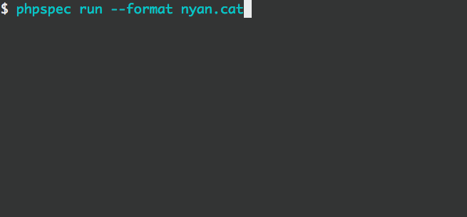

# PHPSpec Nyan Formatters Extension
This PHPSpec extension provides Nyan formatters for PHPSpec.

## Requirements

This extension requires:

 * PHP 5.3.3 or later.
 * A terminal emulator with support for ANSI escape sequences, including color
   and cursor control.

**NOTE:** By default, the Windows console does not support ANSI escape
sequences. If you'd like to use this extension on Windows, you may want
to try one of the following solutions:

 * [ANSICON](https://github.com/adoxa/ansicon)
 * [ConEmu](https://github.com/Maximus5/ConEmu)


## Installation
To install this, make sure you are using the latest release of PHPSpec, and then add the following to your
`composer.json`:

```json
"require-dev": {
    ...,
    "phpspec/nyan-formatters": "2.*"
}
```

Install or update your dependencies, and then in a `phpspec.yml` file in the root of your project, add the following:

```yaml
extensions:
    PhpSpec\NyanFormattersExtension\Extension: ~
```

Then, you can add a `--format` switch to your `phpspec` command with one of the following values:

- `nyan.cat` - Gives the standard Nyan Cat formatter



- `nyan.dino` - Gives a dinosaur formatter - Rawwr!


- `nyan.crab` - Gives a crab formatter


If you want to use one of the formatters all the time, you can enforce a default by adding a `formatter.name` option in
the `phpspec.yml` file as follows:

```yaml
formatter.name: nyan.dino
```

## Authors
This project was written by:

- [Matthew Davis](https://twitter.com/mdavis1982)
- [Jeff Welch](https://twitter.com/whatthejeff)

## Contributions
This project wouldn't have been possible without the help and support of the following people:

- [Marcello Duarte](https://twitter.com/_md)
- [Jakub Zalas](https://twitter.com/jakub_zalas)
- [Christophe Coevoet](https://twitter.com/stof70)
- [Ciaran McNulty](https://twitter.com/ciaranmcnulty)
- [Wouter J](https://github.com/wouterj)
